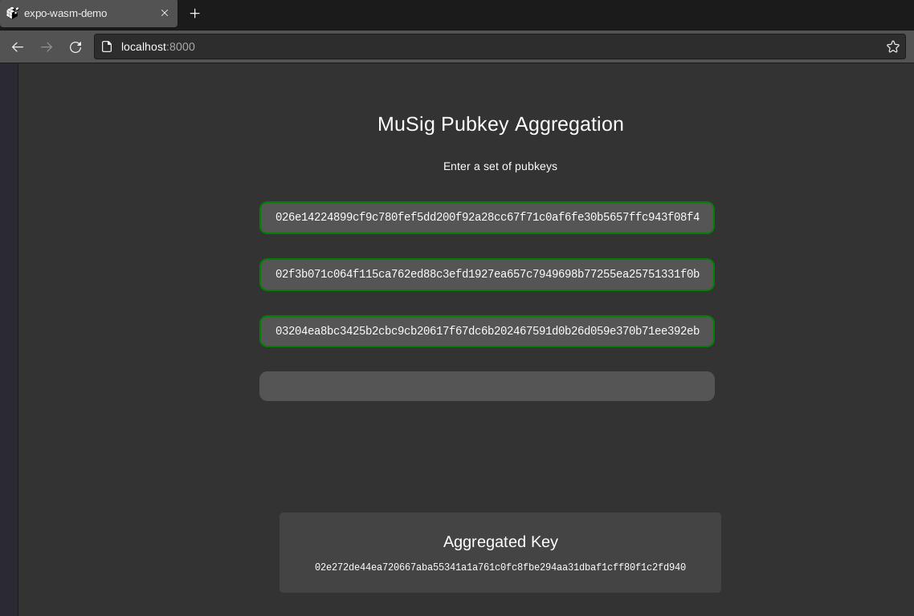
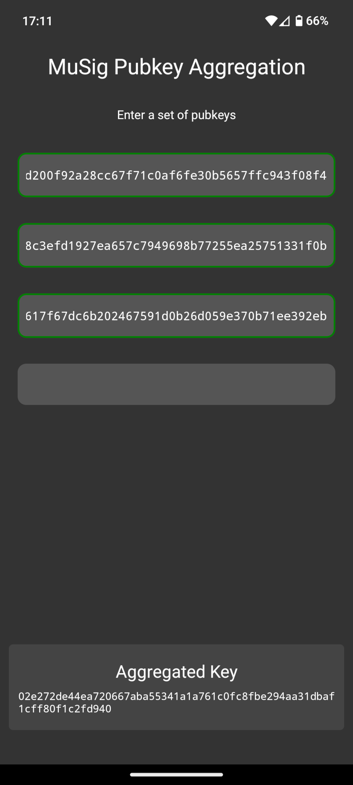

# Expo WASM Demo

This repository is simple [React-Native](https://reactnative.dev) app built with [Expo](https://expo.dev) which demonstrates how to import a [Rust](https://www.rust-lang.org) library via `wasm-pack` + `wasm2js`.

Specifically, this app imports [the `musig2` crate](https://github.com/conduition/musig2) and uses it to securely aggregate secp256k1 public keys together. In principle this approach could be applied to any pure rust crate.

|            Web            |            Android            |
|:-------------------------:|:-----------------------------:|
|  |  |

## Background

Rust is the perfect platform for writing cryptographic primitives due to its precision and safety guarantees. But Rust is definitely NOT the perfect platform for front-end application development.

There are numerous easy-to-use web-app frameworks in countless languages, including some for Rust, but there are very few which support mature production-ready mobile app development.

[Expo](https://expo.dev) is one such framework for Javascript. Expo is built on top of [React Native](https://reactnative.dev/), which is itself built on top of [React](https://react.dev/). Mobile apps built with Expo are not only easy to write, but powerful. Unlike many simple mobile frameworks, Expo provides [a huge library of tools](https://docs.expo.dev/versions/latest/) for leveraging the full power of a mobile platform, all without the need to write a single line of code in any language except Javascript.

However, Expo's simplicity comes at the price of flexibility. Expo doesn't provide an easy way to import external native libraries written in more powerful statically compiled languages like Rust, C++, or Golang. These systems languages are the typical weapon-of-choice for cryptographers, and so a wealth of mature and robust cryptographic code lives outside the reach of Expo app developers. To do so, the dev would need to surrender the simplicity of Expo and descend into the living hell of native-module linking, wrapping, and build configuration.

Who has time for that? Not me, that's for sure. Thankfully, [Rust has support for WebAssembly!](https://rustwasm.github.io/) Huzzah!

Unfortunately, React-Native doesn't. :cry: Well, theoretically it does, but there is precious little documentation available, and [the only viable-looking tool](https://github.com/cawfree/react-native-webassembly) documented to work with Expo [seems to be broken under the current version of React-Native](https://github.com/cawfree/react-native-webassembly/issues/26).

Thankfully, right when I was nearing surrender, I found [this example in the Rust `wasm-bindgen` examples booklet](https://rustwasm.github.io/wasm-bindgen/examples/wasm2js.html). It describes how to use [a tool called `wasm2js`](https://github.com/WebAssembly/binaryen) to compile a `.wasm` file into pure JavaScript, which React-Native can compile directly.

I had to do a bit of fumbling around in the dark, but eventually got it to work correctly on both Web browsers and Android! :tada:


## Setup

First, follow the [Prerequisites for Local App Development with Expo](https://docs.expo.dev/guides/local-app-development/).

Then follow these commands to compile an Android app or Web app using Expo.

```
# Install Rustup
curl --proto '=https' --tlsv1.2 -sSf https://sh.rustup.rs | sh

# Add the wasm32 target for rust
rustup target add wasm32-unknown-unknown

# Install wasm-pack
cargo install wasm-pack

# Install binaryen for access to the wasm2js program
sudo apt install binaryen # Or see https://github.com/WebAssembly/binaryen for manual options

# Download this repo
git clone https://github.com/conduition/expo-wasm-demo.git && cd expo-wasm-demo

# Install NodeJS via NVM
curl -o- https://raw.githubusercontent.com/nvm-sh/nvm/v0.39.7/install.sh | bash
nvm install

# Alternatively, install node v20 or higher manually via some other method
# e.g. sudo apt install nodejs

# Install project dependencies
npm install
```

Now you're ready to rock-and-roll.

```
# Create an android build
make android

# Build the web-app
make web
```
